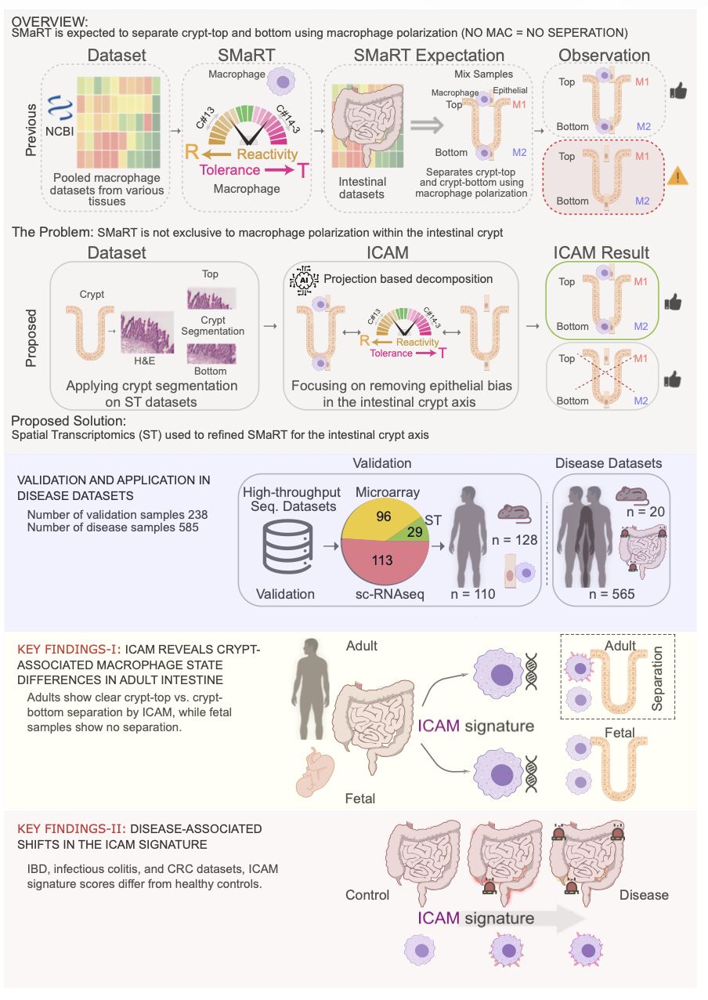

# Spatial Transcriptomics to Resolve Macrophage Polarization along the Intestinal Crypt Axis 

ICAM (Intestinal Crypt Associated Macrophage): A machine learning approach reveals intestinal crypt macrophages at the top and bottom of healthy intestinal crypts.

## Summary



## Requirements
- Python
  - [SquidPy](https://squidpy.readthedocs.io/en/stable/index.html) (v1.2.3)
  - [ScanPy](https://scanpy.readthedocs.io/en/stable/) (v1.9.1)
  - [Matplotlib](https://matplotlib.org/) (v3.5.3)
  - [Seaborn](https://seaborn.pydata.org/index.html) (v0.12.2)
  - [Napari](https://napari.org/stable/) (v0.4.17)
  - [BoNE](https://github.com/sahoo00/BoNE) (Boolean Network Explorer)
- R 
  - [DESeq2](https://bioconductor.org/packages/release/bioc/html/DESeq2.html) (v3.17)


## Citation

```
@article{ICAM2026,
  title  = {Spatial Transcriptomics to Resolve Macrophage Polarization along the Intestinal Crypt Axis},
  author = {H M Zabir Haque, Daniella Vo, Sara Safa, Mojgan Hosseini, and Debashis Sahoo},
  note   = {Manuscript under review}
}
```
